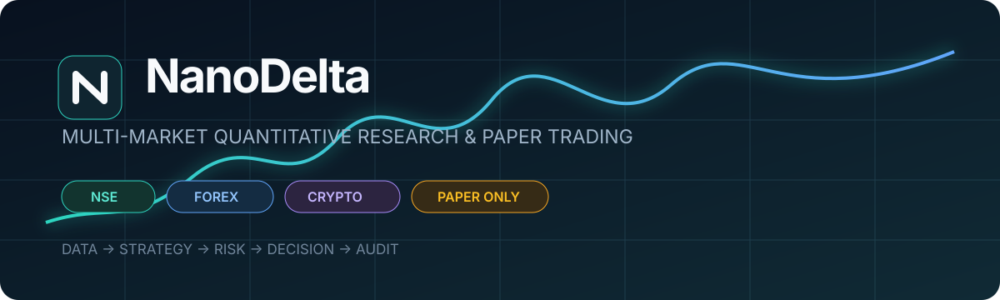
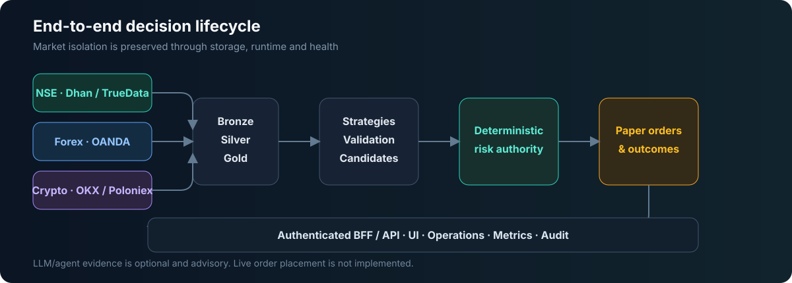

<div align="center">
  

  <br />

  [](https://github.com/ven2day/NanoDelta/actions/workflows/ci.yml)
  [](pyproject.toml)
  [](web/package.json)
  [](migrations/)
  [](#safety-boundary)
  [](LICENSE)

  **One operational surface for NSE, Forex, and Crypto market data, strategy governance,  
  deterministic risk, and audited paper execution.**
</div>

> [!WARNING]
> **NanoDelta is not production-proven yet.** It contains production-oriented foundations, but no
> repository can prove production readiness by code alone. The outstanding evidence is listed in
> [Production readiness](#production-readiness).

## What NanoDelta does

NanoDelta keeps each market isolated while using one shared, auditable lifecycle:

| Market | Historical data | Realtime data | Execution |
|---|---|---|---|
| **NSE** | Dhan; TrueData where capable | TrueData → Dhan fallback | Paper only |
| **Forex** | OANDA | OANDA reconnect/recovery | Paper only |
| **Crypto** | OKX → Poloniex fallback | OKX → Poloniex where capable | Paper only |

The system converts provider payloads into immutable Bronze events, canonical settled Silver
records, reproducible Gold features, validated strategy candidates, deterministic risk decisions,
and paper orders with complete lineage.



## Product surfaces

The Next.js application provides a common overview plus separate NSE, Forex, and Crypto
workspaces. The decision view is where final **BUY** and **SELL** signals appear, together with
qualification, rejection reason, strategy identity, freshness, risk outcome, and paper lifecycle.

| Surface | Purpose | Data source |
|---|---|---|
| Overview | Cross-market health and portfolio state | Authoritative backend API |
| Market workspace | Market-specific readiness, providers and activity | Authoritative backend API |
| Decisions | Final BUY/SELL/ABSTAIN lifecycle and filters | Decision APIs |
| Portfolio & performance | Paper positions and outcomes | Paper APIs |
| Strategies | Registry and approval evidence | Strategy APIs |
| Data Center | Coverage, history status and repair visibility | History APIs |
| Operations | Worker state, heartbeat and health | Operations APIs |

Unavailable backend contracts render an explicit unavailable state; the UI does not invent
representative trading data. See [UI authentication and API integration](docs/UI_AUTH_AND_API.md).

## Architecture

```text
Providers → Bronze → Silver → Gold → Strategy candidate → Validation artifact
                                                       ↓
UI ← BFF/API ← Paper outcomes ← Paper execution ← Deterministic risk
                                                       ↑
                                  Optional bounded agent evidence
```

Key guarantees:

- NSE, Forex, and Crypto have separate schemas, provider routes, workers, health and configuration.
- Only settled candles enter Silver and Gold.
- Provider fallback is capability-specific and uses staleness/recovery controls.
- Strategy admission requires an exact, unexpired validation artifact.
- Agent/LLM output is advisory and cannot approve strategies, change risk or place orders.
- Deterministic risk is the final authority.
- Runtime commands are authenticated, authorized, idempotent and audited.
- Live broker/exchange order placement is intentionally absent.

Read the [architecture](docs/ARCHITECTURE.md), [data engine](docs/ETL_ENGINES.md), and
[strategy governance](docs/STRATEGY_AND_AGENTS.md) documents for the full contracts.

## Quick start with Docker

### Prerequisites

- Docker Engine 24+ with Compose v2
- provider credentials only for markets you enable
- local secret files created from the documented templates

```bash
git clone https://github.com/ven2day/NanoDelta.git
cd NanoDelta

cp .env.production.example .env.production
mkdir -p secrets
openssl rand -base64 48 > secrets/ui_session_key
openssl rand -base64 48 > secrets/grafana_admin_password

docker compose --env-file .env.production -f docker-compose.production.yml build
docker compose --env-file .env.production -f docker-compose.production.yml up -d db migrate api runtime web
```

Then verify:

```bash
curl -fsS http://127.0.0.1:8000/health
docker compose -f docker-compose.production.yml ps
docker compose -f docker-compose.production.yml logs --since=10m api runtime
```

The web UI binds to `127.0.0.1:3000` by default. Place it behind an authenticated TLS reverse
proxy; do not expose database or observability ports directly to the internet.

For exact secret files, user creation, image digests, migrations, backup hooks and rollback, follow
the [production deployment runbook](docs/PRODUCTION_DEPLOYMENT.md) and
[CI/CD contract](docs/CI_CD.md).

## Local development

```bash
python -m venv .venv
source .venv/bin/activate
pip install -e '.[dev]'

pytest
ruff check .
mypy src
```

```bash
cd web
npm ci
npm run lint
npm run build
npm run dev
```

Windows PowerShell activation:

```powershell
py -m venv .venv
.\.venv\Scripts\Activate.ps1
pip install -e ".[dev]"
```

## Runtime and operations

```bash
# Database migrations
nanodelta-migrate

# Supervised NSE, Forex and Crypto workers
nanodelta-runtime

# Optional observability stack
docker compose --env-file .env.production -f docker-compose.production.yml   --profile observability up -d
```

The runtime persists worker lifecycle and heartbeat state and drains on SIGTERM/SIGINT. Prometheus,
Grafana and Alertmanager are provisioned through the optional observability profile. Production
notification receivers and credentials remain deployment-specific.

## Security model

- Secrets are mounted from protected files; they are never committed or sent to browser JavaScript.
- The UI uses a server-side BFF with signed, HttpOnly, SameSite=Strict sessions.
- Backend read/command routes enforce actor roles; commands additionally require idempotency and
  explicit confirmation.
- Images run read-only where practical with `no-new-privileges`.
- CI performs tests, linting, type checks, frontend builds, container builds and dependency audits.
- Release images are published with immutable SHA tags, SBOM and provenance.
- Production deployment is manual, environment-approved and digest-pinned.

The current file-backed UI identity model is appropriate only for a trusted single-host deployment.
Use a managed identity provider and central secret manager before broader exposure.

## Production readiness

| Capability | Repository status | Evidence still required |
|---|---|---|
| Dockerized API, runtime, UI and TimescaleDB | Implemented | Successful deployment on the target host |
| Guarded CI/CD and immutable images | Implemented | Green GitHub checks and an approved deployment |
| Supervised multi-market runtime | Implemented | Long-running credentialed session |
| Realtime routing and failover | Implemented in provider branches | Provider-entitled soak and failover proof |
| TimescaleDB migrations and isolation | Implemented | Deployed DB inspection and retention verification |
| Metrics, dashboards and alerts | Implemented | Real receiver test and production monitoring run |
| Backup/restore hooks | Implemented | Timed restore drill with verified data |
| Authentication and authorization | Single-host foundation | Managed IdP and distinct backend principals |
| UI authoritative reads | Partially integrated | Remaining APIs and real UI capture |
| Strategy validation | Research-stage strategies | Larger samples and approved artifacts |
| Paper execution | Deterministic engine | Real provider → decision → paper outcome session |
| Performance/resilience | Fast deterministic suite exists | Full load, latency, one-hour+ soak and host failover |

**Readiness rule:** NanoDelta becomes production-ready only when the target environment has dated,
repeatable evidence for deployment, provider connectivity, database durability, monitoring,
security controls, backup recovery, performance and end-to-end paper trading. See the
[implementation roadmap](docs/IMPLEMENTATION_ROADMAP.md).

## Safety boundary

NanoDelta is a research and **paper-trading** system. It has no live-order authority and is not
financial advice. Any future live execution capability requires a separate threat model, broker
adapter, kill switch, reconciliation service, approvals and operational sign-off.

## Repository map

```text
src/nanodelta/       Python domain, providers, pipelines, risk, paper and API
web/                 Next.js authenticated operations UI
migrations/          Versioned PostgreSQL/TimescaleDB migrations
config/              Market universe and safe templates
env/                 Environment templates
deploy/              Deployment, backup and observability assets
tests/               Unit, contract, integration and acceptance tests
docs/                Architecture and operational runbooks
.github/workflows/   CI, image publishing and guarded deployment
```

## Documentation

- [Documentation map](docs/README.md)
- [Architecture](docs/ARCHITECTURE.md)
- [Database and incremental loading](docs/DATABASE_AND_INCREMENTAL_LOAD.md)
- [Executable runtime](docs/EXECUTABLE_RUNTIME.md)
- [Production deployment](docs/PRODUCTION_DEPLOYMENT.md)
- [CI/CD](docs/CI_CD.md)
- [Observability](docs/OBSERVABILITY.md)
- [UI authentication and API integration](docs/UI_AUTH_AND_API.md)
- [Strategy and agent governance](docs/STRATEGY_AND_AGENTS.md)
- [Implementation roadmap](docs/IMPLEMENTATION_ROADMAP.md)

## License

[MIT](LICENSE). External providers and optional upstream frameworks retain their own licensing and
data-entitlement requirements.
